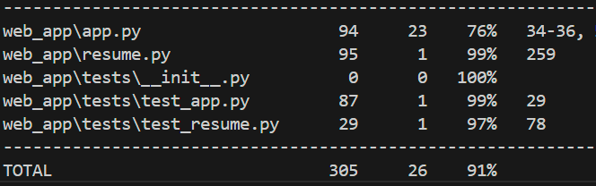

# **📄 resume.ly**

## Description

Our Resume Builder is a streamlined webapp that allows users to easily build a formatted resume. It also stores users' generated resumes to be accessed at will.

## Docker Image

You can access the Docker image for **resume.ly** on Docker Hub:

[**resume.ly Docker Image**](https://hub.docker.com/r/fav2019/flask-app)

## Run the App

### Environment Setup

Before running the app, ensure your `.env` file in the `web_app` directory contains the following MongoDB URI configuration:

```
MONGO_URI=mongodb://mongodb:27017/
```

Start by building:

```
docker-compose up --build
```

If you've already built previously, you may compose the containers like so:

```
docker-compose up
```

Once the setup is complete, access the app by visiting the following URL in your browser:

[**Visit the App**](http://127.0.0.1:5002)

## Team Members

[Shray Awasti](https://github.com/shrayawasti)

[Safia Billah](https://github.com/safiabillah)

[Fatima Villena](https://github.com/favils)

[Melanie Zhang](https://github.com/melanie-y-zhang)


## Test Coverage


